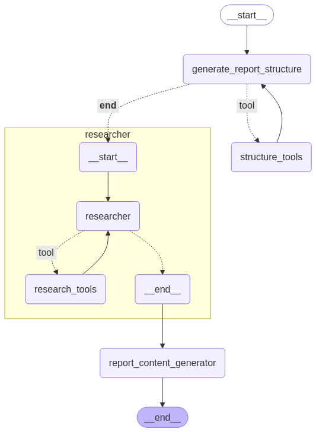

# AI Report Generator

[](LICENSE)
[](https://streamlit.io/)
[](https://github.com/pro402/ai-report-generator)

AI Report Generator is a robust tool that leverages state-of-the-art language models and AI-driven search functionalities to dynamically create detailed reports, newsletters, or blogs. The project harnesses a state graph workflow, integrating research, content generation, and interactive user interfaces to deliver high-quality, structured content.

## Table of Contents

- [Overview](#overview)
- [Demo](#demo)
- [Features](#features)
- [Technologies Used](#technologies-used)
- [Project Structure](#project-structure)
- [Installation](#installation)
- [Usage](#usage)
- [Converting Markdown to PDF](#converting-markdown-to-pdf)
- [Customization](#customization)
- [Roadmap](#roadmap)
- [Contributing](#contributing)
- [License](#license)
- [Acknowledgements](#acknowledgements)

## Overview

The AI Report Generator is designed to streamline the creation of comprehensive content by:
- Generating well-organized outlines based on user-provided topics and instructions.
- Performing deep research using integrated AI search tools for general, finance, and news queries.
- Compiling and formatting final reports in markdown format, which can be easily converted to PDF using pandoc and related tools.

This project is ideal for content creators, researchers, and anyone looking to automate the production of detailed written materials.

## Demo

### Interactive Demo Video
Watch our local demo video to see the AI Report Generator in action. This demo showcases:
- **User Interface Walkthrough:** An overview of the Streamlit-based UI where you input parameters.
- **Workflow Visualization:** How the state graph transitions from research to content generation.
- **Report Generation:** The process of generating, previewing, and downloading a report.

Click the video below to view it:
[](https://www.youtube.com/watch?v=HFsXR69v3nE)

### Additional Demo Assets
- **Graph Workflow Diagram:**  
    
  _This diagram illustrates the state transitions from initial research through final report generation._

- **Sample Generated Reports:**  
  - [View Sample Report (Markdown)](demos/report(2).md)
  - [View Sample Report (Markdown)](demos/responsibleAI.md)

## Features

- **Dynamic Report Generation:**  
  Automatically generates structured reports, newsletters, or blogs from a given topic and outline.

- **AI-Powered Deep Research:**  
  Integrates with specialized search tools (via the Tavily API) to fetch up‑to‑date research and news, ensuring the content is current and comprehensive.

- **State Graph Workflow:**  
  Utilizes a robust state graph (powered by [LangGraph](https://github.com/langgraph/langgraph)) to manage multi-stage processes—from initial research to final report composition.

- **Interactive Web Interface:**  
  Built using [Streamlit](https://streamlit.io/), the interface allows users to input parameters, visualize report structure, and download the final markdown document.

- **Customizable Workflow:**  
  Easily extend the system by modifying the state graph and integrating new tools or prompts to better suit your content needs.

## Technologies Used

- **Language Models & AI Tools:**
  - [LangChain](https://github.com/hwchase17/langchain)
  - [ChatNVIDIA Deepseek Model](https://build.nvidia.com/deepseek-ai/deepseek-r1)

- **Workflow Management:**
  - [LangGraph](https://github.com/langgraph/langgraph)

- **APIs & Libraries:**
  - [Tavily API](https://tavily.com/) for search functionalities
  - [Streamlit](https://streamlit.io/) for the web interface

- **Python Ecosystem:**
  - Environment management with [dotenv](https://github.com/theskumar/python-dotenv)

## Project Structure

- **workflow.py:**  
  Orchestrates the research and report generation processes using a state graph to define transitions and interactions.

- **tools.py:**  
  Contains custom tool functions for executing general, finance, and news searches via the Tavily API.

- **report_generator.py:**  
  Implements AI-driven content generation, from creating detailed outlines to final report assembly, using ChatNVIDIA and LangChain.

- **models.py:**  
  Defines the data models (using TypedDicts) for managing Report and Research states throughout the workflow.

- **streamlit_app.py:**  
  Provides a sleek Streamlit interface for users to input parameters, trigger the report generation workflow, and download the final content.

- **requirements.txt:**  
  Lists all necessary dependencies to run the project.

- **.gitignore & .env_example:**  
  Standard configuration files to manage environment variables and ignore unnecessary files in version control.

## Installation

### Prerequisites

- Python 3.8 or higher
- [pip](https://pip.pypa.io/)

### Setup Steps

1. **Clone the Repository:**

   ```bash
   git clone https://github.com/your-username/ai-report-generator.git
   cd ai-report-generator
   ```

2. **Create and Activate a Virtual Environment:**

   ```bash
   python -m venv venv
   source venv/bin/activate  # On Windows: venv\Scripts\activate
   ```

3. **Install Dependencies:**

   ```bash
   pip install -r requirements.txt
   ```

4. **Configure Environment Variables:**

   - Duplicate the `.env_example` file to `.env`:
     
     ```bash
     cp .env_example .env
     ```

   - Update the `.env` file with your API keys for `TAVILY_API_KEY` and `NVIDIA_API`.

## Usage

### Running the Application

Launch the Streamlit interface by executing:

```bash
streamlit run streamlit_app.py
```

### Generating a Report

1. **Input Parameters:**  
   Provide the topic, select the report type (Report, News Letter, Blog), and define an outline for the content.

2. **Initiate Generation:**  
   Click on **Generate Report** to start the multi-stage workflow that:
   - Generates a detailed report structure.
   - Performs deep research to fetch relevant content.
   - Compiles a final report in markdown format.

3. **Download Report:**  
   View the generated structure and report on-screen and download the final markdown file using the provided download button.

## Converting Markdown to PDF

To convert your generated markdown report to PDF, follow these steps (Ubuntu/Debian):

1. **Install Pandoc and TeX Live packages:**

   ```bash
   sudo apt-get install -y pandoc
   sudo apt-get install -y texlive-xetex texlive-fonts-recommended texlive-plain-generic
   ```

2. **Convert the Markdown file to PDF:**

   ```bash
   pandoc report.md -o report.pdf
   ```

This command converts `report.md` to `report.pdf` using Pandoc. Adjust the filenames as needed.

## Customization

- **Workflow Extensions:**  
  Enhance or modify the state graph in `workflow.py` to include new research or content generation steps.

- **Tool Integration:**  
  Add or update functions in `tools.py` to support additional search topics or integrate different APIs.

- **Prompt Tuning:**  
  Adjust the prompts in `report_generator.py` to refine the AI-generated content or match a particular writing style.

## Roadmap

- **Feature Enhancements:**
  - Integrate more domain-specific search tools.
  - Add support for multi-language reports.
  - Improve prompt tuning for better content consistency.

- **UI Improvements:**
  - Enhance the Streamlit dashboard with more interactive elements.
  - Implement progress indicators for long-running tasks.

- **Community Contributions:**
  - Gather feedback from users and incorporate feature requests.
  - Expand documentation with tutorials and usage examples.

## Contributing

Contributions are highly appreciated! To contribute:

1. Fork the repository.
2. Create a new branch for your feature or bug fix.
3. Commit your changes with clear commit messages.
4. Open a pull request for review.

## License

This project is licensed under the MIT License. See the [LICENSE](LICENSE) file for complete details.

## Acknowledgements

- **LangChain & LangGraph:**  
  For providing frameworks that simplify complex workflows.
- **Streamlit:**  
  For enabling rapid development of interactive data applications.
- **Tavily & NVIDIA:**  
  For their APIs that power advanced search and content generation capabilities.
- **Community Contributions:**  
  Thanks to all open source contributors who make projects like this possible.